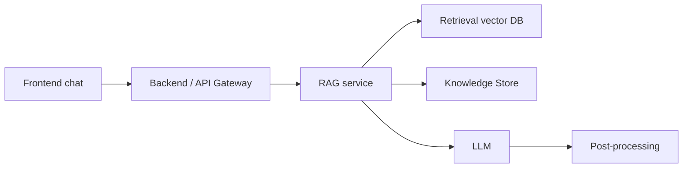

# Design-Doc: Чат-бот / RAG-система

*(Заполняется проектной командой: бизнес-заказчик, ML/инженеры, продуктовая команда)*

## 1. Контекст проекта

### 1.1 Бизнес-задача

* Сократить нагрузку на операторов и ускорить обработку клиентских запросов за счёт автоматизации до 60–80% типовых вопросов.
* Обеспечить быстрый и консистентный доступ к внутренним знаниям (регламенты, инструкции, FAQ) в едином интерфейсе.
* Повысить удовлетворённость пользователей за счёт точных, актуальных и персонализированных ответов.

### 1.2 Целевая аудитория и пользователи

* Внутренние сотрудники (служба поддержки, продажи, HR, операционные команды).
* Клиенты/партнёры.
* Сценарии: текстовый чат в веб-виджете, интерфейс в корпоративном портале, интеграция с мессенджерами (Teams/Telegram), возможное расширение на голосовой интерфейс.
* Нагрузка: 5–10k сессий/сутки, пики в рабочие часы 10:00–16:00.

### 1.3 Ограничения и допущения

* Не покрываем транзакционные операции (например, изменения в профиле клиента), только информационные ответы.
* Не обрабатываем чувствительные персональные данные без явного разрешения.
* Предполагаем наличие доступа к актуальным корпоративным документам и API.
* Инфраструктура — облако/гибрид; требования к безопасности — соответствует внутренним политикам.

---

## 2. Архитектура решения

### 2.1 Общая схема

* Фронтенд (чат-интерфейс) → Backend/API Gateway → RAG-сервис → Retrieval (векторное хранилище) + Knowledge Store → LLM → Post-processing (фильтры, форматирование).

* Основные компоненты: чат UI, API, сервис обработки диалогов, RAG-движок, хранилище данных, мониторинг.

### 2.2 Хранилище знаний / документооборот

* Источники: корпоративный Wiki, внутренние PDF, регламенты, базы знаний, экспорт из Jira/Confluence, внешние API.
* Предобработка: парсинг PDF/HTML, очистка, сегментация по смысловым блокам, извлечение метаданных.
* Индексация: создание embedding, добавление меток (дата, тип документа, владелец), сохранение в векторный индекс.
* Обновление: автоматическая синхронизация 1 раз в сутки + ручное обновление по запросу контент-менеджера.

### 2.3 Retrieval + Generation

* Retrieval: Qdrant/FAISS в зависимости от среды; cosine similarity; embedding размер 768–1024; k=3–5.
* Generation: LLM (например, OpenAI GPT-4.1/GPT-5 или локальная Llama-3.1) с шаблонными промптами.
* Контроль ответа: фильтрация нерелевантных результатов по threshold; fallback на статические FAQ; детектор галлюцинаций через self-check prompt.

### 2.4 Интеграции и интерфейсы

* Интеграции: CRM, базы пользователей (SSO/LDAP), система логирования, мониторинг (Prometheus, Grafana), корпоративные мессенджеры.
* Протоколы: REST для запросов, WebSockets для real-time диалогов, Webhooks для событий.

### 2.5 Инфраструктура и развертывание

* Docker-контейнеры, оркестрация через Kubernetes (dev/test/prod).
* Вычисления: CPU для retrieval, GPU — для LLM (если локальная); объём хранилища — 50–200 GB.
* Безопасность: OAuth2/SSO, TLS, контроль доступа по ролям, аудит действий.
* Масштабирование: горизонтальное масштабирование сервисов API и RAG.

---

## 3. Данные и качество знаний

### 3.1 Сбор и предобработка данных

* Форматы: PDF, DOCX, HTML, TXT, структурированные базы данных.
* Предобработка: извлечение текста, очистка, токенизация, выделение сущностей, сегментация на чанки 400–1200 символов.
* Добавление метаданных: тип документа, раздел, дата загрузки, версия документа.

### 3.2 Векторизация и индексирование

* Embedding-модель: text-embedding-3-large или аналогичная мультиязычная.
* Индекс: HNSW (cosine), 1–3 реплики, шардирование по типу данных.
* Стратегия обновлений: инкрементальная индексация + еженедельная пересборка для консистентности.

### 3.3 Метрики качества знаний

* Покрытие — доля документов, доступных системе (цель 90%).
* Актуальность — документы не старше 30 дней; SLA обновлений — 24 часа.
* Консистентность — отсутствие дубликатов; проверка конфликтующих инструкций.

---

## 4. Модель и генерация

### 4.1 Выбор LLM и промптинг

* Используем GPT-4.1/GPT-5 (облако) либо Llama-3.1-70B (локально) — оптимальное соотношение качества/стоимости.
* Промпт-шаблон: инструкции + retrieved context + ограничения формата + стиль.
* Ограничения: 8k–32k токенов контекста, среднее время генерации < 2 сек.

### 4.2 Контроль качества ответов

* Метрики: точность (manual eval), полнота, релевантность, полезность.
* Оценка ошибок: каталогизация галлюцинаций, детекция пустых ответов.
* Механизмы: reranking retriever’а, fallback «Извините, не нашёл…», ручное ревью спорных случаев.

### 4.3 Обучение/дообучение

* Fine-tuning при необходимости на корпоративных диалогах: фильтрация данных, размеченные пары.
* Версионность через MLflow/Weights & Biases; rollback — через хранение предыдущей модели.

---

## 5. UX / пользовательский опыт

### 5.1 Сценарии взаимодействия

* Приветствие → формирование запроса → уточняющие вопросы → ответ.
* Поиск по знаниям (FAQ, регламенты), многотуровый диалог.
* Исключения: отсутствие ответа, некорректные запросы, эскалация к оператору.

### 5.2 Диалоговая логика

* Поддержка контекста: хранение последних 5–10 сообщений.
* Multi-turn управление: слоты, уточнения, краткие подсказки.
* Тон: нейтральный, профессиональный; поддержка мультиязычности.

### 5.3 Метрики UX

* Время до первого ответа (< 1.5 сек), CSAT, NPS, % повторных обращений.
* Логирование всех диалогов; сбор пользовательских оценок.

---

## 6. Безопасность, соответствие и этика

* Обработка данных по внутренним политикам безопасности и GDPR.
* Фильтры токсичности и небезопасного контента.
* Прозрачность: маркировка, что пользователь общается с ботом.
* Минимизация хранения персональных данных, шифрование в покое и в транзите.

---

## 7. План внедрения и эксплуатации

### 7.1 Этапы проекта

* Фаза 0 — исследование, сбор требований, аудит документов (2 недели).
* Фаза 1 — MVP: базовое Retrieval + LLM, чат-интерфейс (4–6 недель).
* Фаза 2 — расширение: улучшенный retriever, обновление индекса, интеграции (6–8 недель).
* Фаза 3 — оптимизация и масштабирование, A/B-тесты (4 недели).

### 7.2 Поддержка и эксплуатация

* Ответственные: команда DevOps/SRE + ML команда + контент-менеджер.
* Мониторинг: SLA 99%, latency, cost per request, ошибки.
* Регулярное обновление знаний (ежедневно), ежемесячная ревизия качества.

---

## 8. Риски и допущения

* Недостаточная полнота базы знаний → низкая точность ответов.
* Возможные галлюцинации модели → риск недостоверных ответов.
* Ограничения бюджета для облачных LLM → необходимость локальной модели.
* Непроверенные допущения: качество исходных документов, готовность команд к интеграциям.

---

## 9. Бюджет и ресурсы

* **Человеческие ресурсы:**

  * 1 ML инженер
  * 1 NLP инженер / MLE
  * 1 Backend инженер
  * 1 DevOps/SRE
  * 1 Product Owner
  * 1 UX/UI дизайнер
  * 1 Контент-менеджер

* **Технологические ресурсы:**

  * GPU/CPU кластеры, облачные LLM кредиты, хранилище S3/Blob.

* **Примерные затраты:**

  * CAPEX: разработка, интеграции, инфраструктура.
  * OPEX: запросы к модели, поддержка, обновление знаний.

* **ROI оценки:**

  * Снижение затрат на операторов 20–40%.
  * Ускорение ответа ×3–5.
  * Рост удовлетворённости клиентов на 15–25%.

---

## 10. Приложения

* Словарь терминов и аббревиатур
* Ссылки на требования безопасности и UX-гайды
* Диаграммы архитектуры и логики диалога
* Чек-лист готовности к запуску
