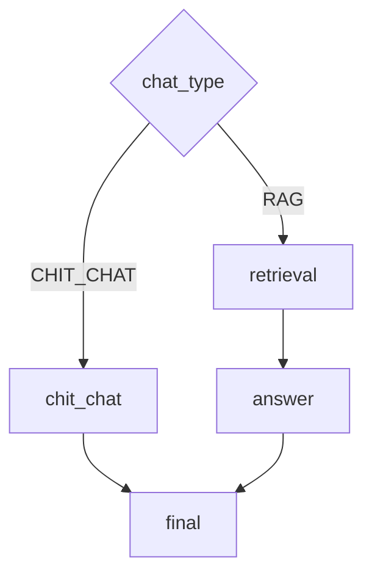

# test

```mermaid
graph TD
    chat_type{"chat_type"}
    chat_type -->|RAG| retrieval
    chat_type -->|CHIT_CHAT| chit_chat
    chit_chat["chit_chat"]
    chit_chat --> final
    retrieval["retrieval"]
    retrieval --> answer
    answer["answer"]
    answer --> final
    final["final"]
```
